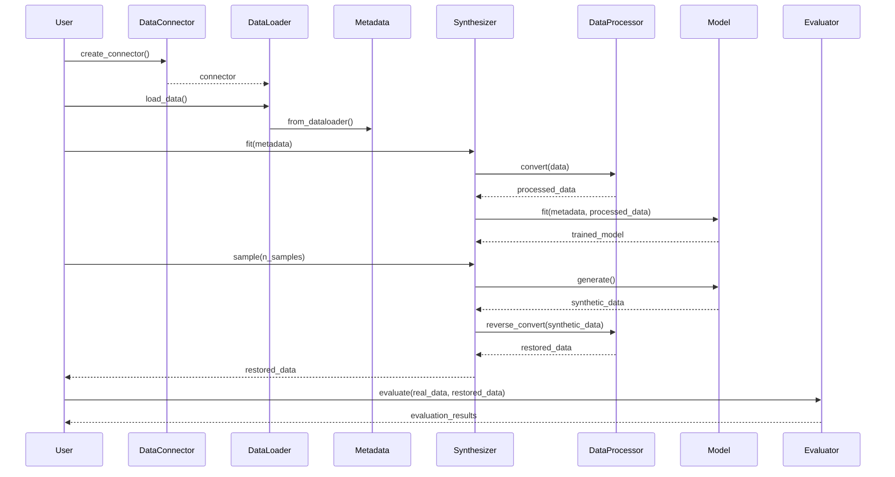
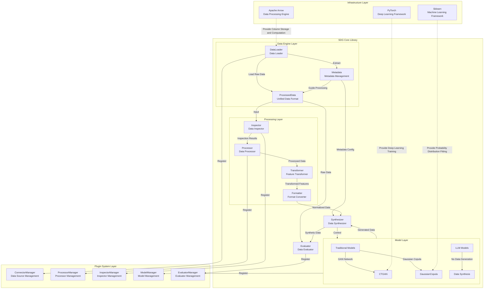
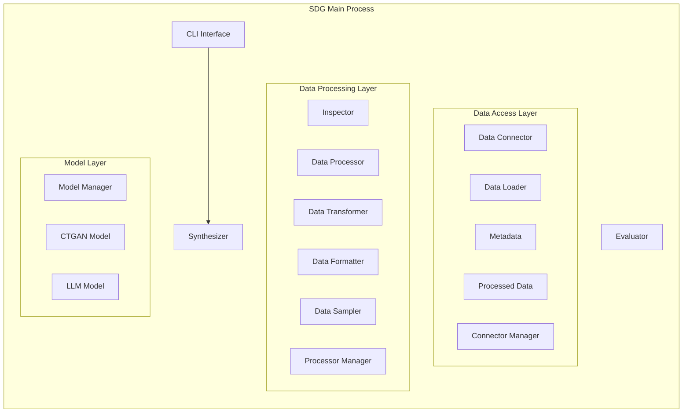
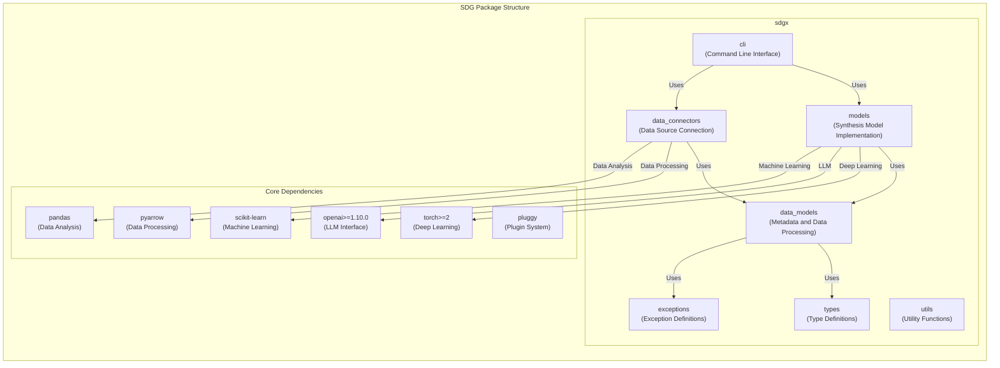
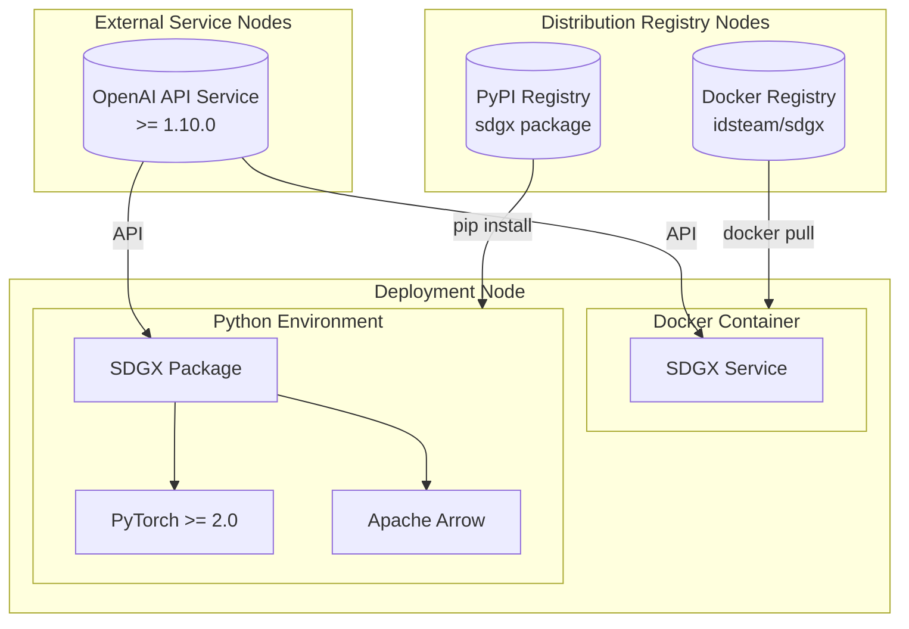
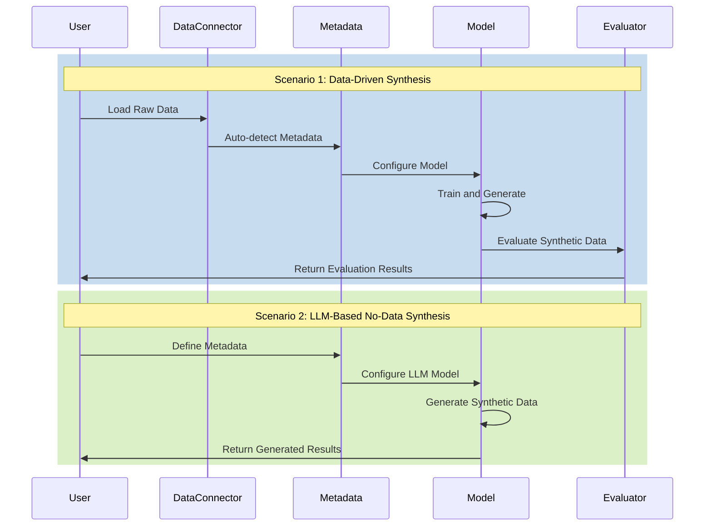

# Overview

## Technical

The following is a list of technologies involved in this project.

| Technology      | Category           | Purpose                                                                                                                                                                                                                                                                                        |
| --------------- | ------------------ | ---------------------------------------------------------------------------------------------------------------------------------------------------------------------------------------------------------------------------------------------------------------------------------------------- |
| PyTorch         | Deep Learning      | Mainstream deep learning framework providing dynamic computation graphs and automatic differentiation. Used for: - Building and training generative models like VAE - GPU-accelerated model training - Implementing custom neural network layers and loss functions - Model saving and loading |
| NumPy           | Deep Learning      | Fundamental scientific computing library with version constraint for stability. Used for: - Efficient multi-dimensional array operations - Data preprocessing and feature engineering - Numerical computation and statistical analysis - Data interchange with other scientific libraries      |
| SciPy           | Deep Learning      | Advanced scientific computing toolkit built on NumPy. Used for: - Advanced statistical analysis and hypothesis testing - Probability distribution calculation and random number generation - Optimization algorithms - Sparse matrix operations and linear algebra computations                |
| Pandas          | Deep Learning      | Powerful data analysis and manipulation library. Used for: - Structured data I/O - Data cleaning and preprocessing - Complex data transformation and aggregation - Time series data handling                                                                                                   |
| scikit-learn    | Deep Learning      | Machine learning algorithm toolkit. Used for: - Data preprocessing and feature scaling - Model evaluation and cross-validation - Feature selection and dimensionality reduction - ML model benchmarking                                                                                        |
| Faker           | Data Generation    | Multi-language fake data generation library. Used for: - Test dataset generation - System testing with mock data - Example data generation - Custom data generation rule support                                                                                                               |
| Matplotlib      | Data Evaluation    | Comprehensive plotting library. Used for: - Training process visualization - Data distribution and statistical plotting - Model evaluation visualization - Report and documentation graphics                                                                                                   |
| table-evaluator | Data Evaluation    | Specialized tabular data evaluation tool. Used for: - Statistical comparison between real and synthetic data - Data generation quality assessment - Data quality reporting - Distribution comparison visualization                                                                             |
| PyArrow         | Data Processing    | High-performance data processing library. Used for: - Fast I/O for large-scale data - Memory-efficient data processing - Integration with big data tools - Columnar data format handling                                                                                                       |
| Pydantic        | Data Processing    | Data validation and settings management framework. Used for: - Type-safe configuration loading - API data validation - Model parameter validation - Data schema definition and verification                                                                                                    |
| loguru          | Logging            | Modern logging utility. Used for: - Training process logging - Error tracking and debugging - Performance monitoring - Structured log output                                                                                                                                                   |
| cloudpickle     | Data Processing    | Enhanced Python object serialization tool. Used for: - Model serialization and deserialization - Complex Python object persistence - Data transfer in distributed computing - Intermediate result caching                                                                                      |
| pluggy          | Plugin System      | Python plugin framework. Used for: - Implementing extensible architecture - Managing model and processor plugins - Supporting custom component integration - Implementing modular design                                                                                                       |
| joblib          | Parallel Computing | Parallel computing support library. Used for: - Data processing parallelization - CPU-intensive task optimization - Result caching - Parallel model training                                                                                                                                   |
| Click           | CLI Tools          | Command-line interface framework. Used for: - Building CLI tools - Parameter parsing and validation - Subcommand management - User interaction interface                                                                                                                                       |

## Core Process Diagram



## 4+1 architectural view

### Logical view



### Process view



### Development view



### Physical view



### Scenarios



# Development Guide

## Clone project

```sh
git clone https://github.com/hitsz-ids/synthetic-data-generator.git
```

## Create python env

This is based on [miniconda](https://docs.anaconda.com/miniconda/).

```sh
conda create -n sdg python=3.11
conda activate sdg
```

## Code Style and Lint

We use [black](https://github.com/psf/black) as the code formatter, the best way to use it is to install the pre-commit hook, it will automatically format the code before each commit

Install pre-commit before commit

```bash
pip install pre-commit
pre-commit install
```

Pre-commit will automatically format the code before each commit, It can also be executed manually on all files

```bash
pre-commit run --all-files
```

Comment style follows [Google Python Style Guide](https://google.github.io/styleguide/pyguide.html#38-comments-and-docstrings).

## Install Locally

```bash
pip install -e '.[test,docs]'
```

## Unit tests

We use pytest to write unit tests, and use pytest-cov to generate coverage reports

```bash
pytest -vv --cov-config=.coveragerc --cov=sdgx/ tests
```

Run unit-test before PR, **ensure that new features are covered by unit tests**

## Build Docs

Install docs dependencies

```bash
pip install -e .[docs]
```

Build docs

```bash
cd docs && make html
```

Use [start-docs-host.sh](dev-tools/start-docs-host.sh) to deploy a local http server to view the docs

```bash
cd ./dev-tools && ./start-docs-host.sh
```

Access `http://localhost:8910` for docs.

## Started with the features

After understanding all the content mentioned in the overview of this chapter, we recommend starting with the sdg functionality. You can explore everything under the tests/ package, using the LLM Chat Tool (such as cursor) to add test and tested classes, thereby gaining insight into the detailed functionalities you want to understand.

Here we provide a system-role prompt for the LLM Chat Tool to help you formulate good questions.

```sh
Please provide a detailed explanation of the logic and implementation of the following Python class. In addition to reviewing the code for this class, you also need to look at the code for the subject class being tested:
1. Describe the overall functionality and purpose of this class, including the subject being tested, its functions, and basic usage logic.
2. Analyze each method in the class, explaining its functionality and parameters.
3. Explain any important algorithms or design patterns used in the class.
```
