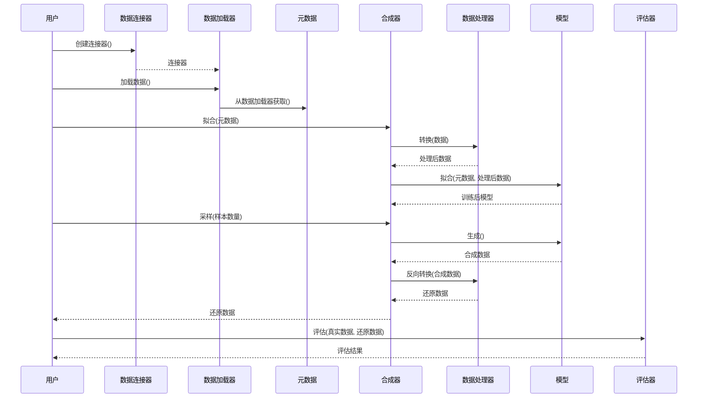
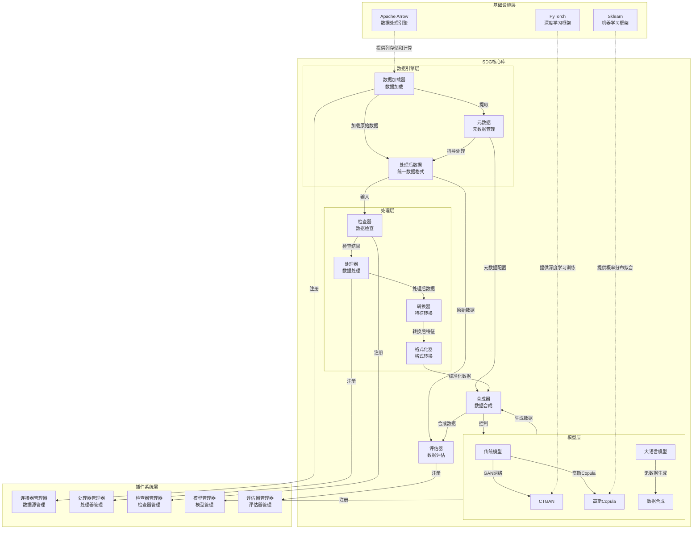
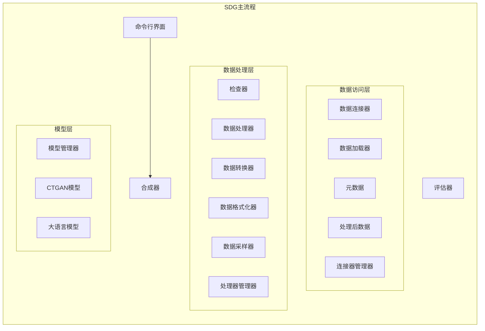
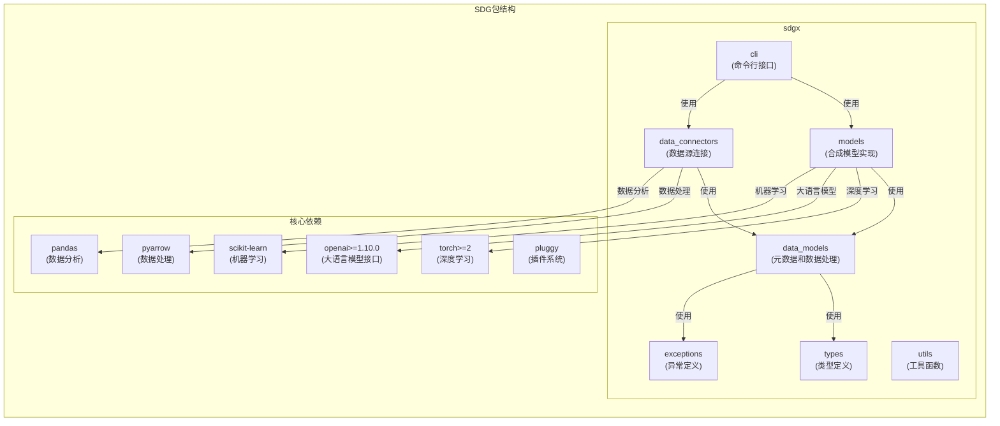
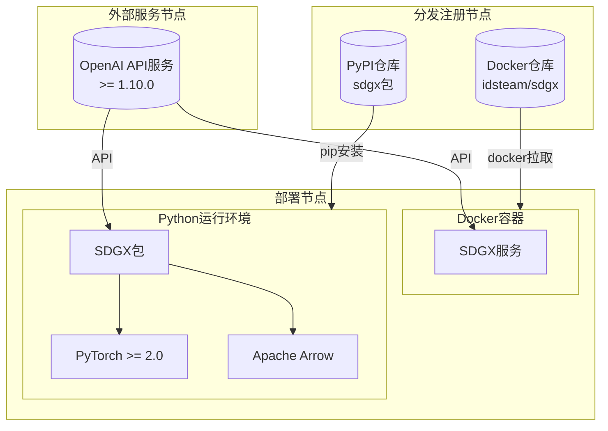
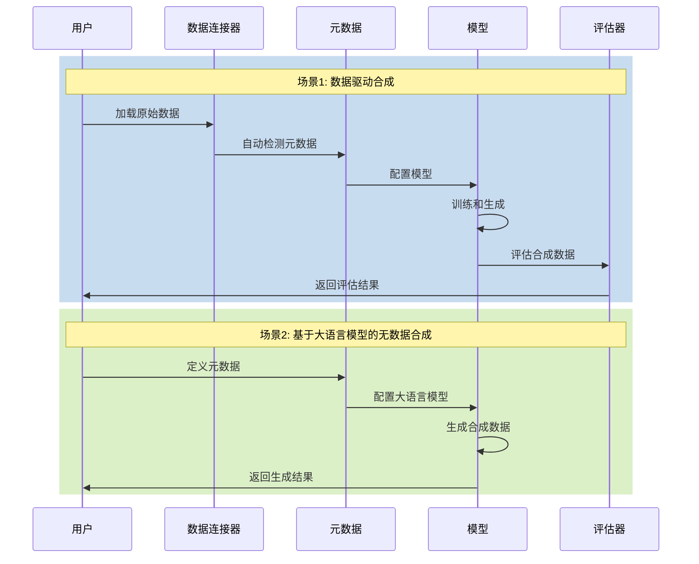

# 概览

## 技术框架

以下是此项目涉及的技术列表。

|      技术       |   类别   |                                                                       目的                                                                       |
| :-------------: | :------: | :----------------------------------------------------------------------------------------------------------------------------------------------: |
|     PyTorch     | 深度学习 | 主流深度学习框架，提供动态计算图和自动微分。用于： - 构建和训练生成模型如VAE - GPU加速模型训练 - 实现自定义神经网络层和损失函数 - 模型保存和加载 |
|      NumPy      | 深度学习 |      基础科学计算库，版本限制用于保持稳定性。用于： - 高效多维数组运算 - 数据预处理和特征工程 - 数值计算和统计分析 - 与其他科学库的数据交换      |
|      SciPy      | 深度学习 |        基于NumPy的高级科学计算工具包。用于： - 高级统计分析和假设检验 - 概率分布计算和随机数生成 - 优化算法 - 稀疏矩阵运算和线性代数计算         |
|     Pandas      | 深度学习 |                  强大的数据分析和操作库。用于： - 结构化数据输入输出 - 数据清洗和预处理 - 复杂数据转换和聚合 - 时间序列数据处理                  |
|  scikit-learn   | 深度学习 |                  机器学习算法工具包。用于： - 数据预处理和特征缩放 - 模型评估和交叉验证 - 特征选择和降维 - 机器学习模型基准测试                  |
|      Faker      | 数据生成 |                    多语言虚拟数据生成库。用于： - 测试数据集生成 - 系统测试的模拟数据 - 示例数据生成 - 自定义数据生成规则支持                    |
|   Matplotlib    | 数据评估 |                            综合绘图库。用于： - 训练过程可视化 - 数据分布和统计绘图 - 模型评估可视化 - 报告和文档图形                            |
| table-evaluator | 数据评估 |                 专门的表格数据评估工具。用于： - 真实数据与合成数据的统计比较 - 数据生成质量评估 - 数据质量报告 - 分布比较可视化                 |
|     PyArrow     | 数据处理 |                 高性能数据处理库。用于： - 大规模数据的快速输入输出 - 内存高效的数据处理 - 与大数据工具的集成 - 列式数据格式处理                 |
|    Pydantic     | 数据处理 |                      数据验证和设置管理框架。用于： - 类型安全的配置加载 - API数据验证 - 模型参数验证 - 数据模式定义和验证                       |
|     loguru      | 日志记录 |                               现代日志工具。用于： - 训练过程日志记录 - 错误跟踪和调试 - 性能监控 - 结构化日志输出                               |
|   cloudpickle   | 数据处理 |             增强的Python对象序列化工具。用于： - 模型序列化和反序列化 - 复杂Python对象持久化 - 分布式计算中的数据传输 - 中间结果缓存             |
|     pluggy      | 插件系统 |                       Python插件框架。用于： - 实现可扩展架构 - 管理模型和处理器插件 - 支持自定义组件集成 - 实现模块化设计                       |
|     joblib      | 并行计算 |                              并行计算支持库。用于： - 数据处理并行化 - CPU密集型任务优化 - 结果缓存 - 并行模型训练                               |
|      Click      | CLI工具  |                                命令行界面框架。用于： - 构建CLI工具 - 参数解析和验证 - 子命令管理 - 用户交互界面                                 |

## 核心流程图



## 4+1 架构视图

### 逻辑视图



### 进程视图



### 开发视图



### 物理视图



### 场景视图



# 开发指南

## 克隆项目

```sh
git clone https://github.com/hitsz-ids/synthetic-data-generator.git
```

## 创建 Python 环境

基于[miniconda](https://docs.anaconda.com/miniconda/) 创建环境。

```sh
conda create -n sdg python=3.11
conda activate sdg
```

## 代码风格和检查

我们使用 [black](https://github.com/psf/black) 作为代码格式化工具，最佳使用方式是安装 pre-commit 钩子，它会在每次提交前自动格式化代码。

在提交前安装 pre-commit

```bash
pip install pre-commit
pre-commit install
```

Pre-commit 会在每次提交前自动格式化代码，也可以手动对所有文件执行格式化

```bash
pre-commit run --all-files
```

注释风格遵循 [Google Python风格指南](https://google.github.io/styleguide/pyguide.html#38-comments-and-docstrings)。

## 本地安装

```sh
pip install -e '.[test,docs]'
```

## 单元测试

我们使用 pytest 编写单元测试，使用 pytest-cov 生成覆盖率报告

```bash
pytest -vv --cov-config=.coveragerc --cov=sdgx/ tests
```

在提交PR前请运行单元测试，**确保新功能已被单元测试覆盖**

注意，测试过程中会从 GitHub 下载测试数据，因此最好**开启全局代理**，以保证网络连通性

## 构建文档

安装文档依赖

```bash
pip install -e .[docs]
```

构建文档

```bash
cd docs && make html
```

使用 [start-docs-host.sh](dev-tools/start-docs-host.sh) 部署本地HTTP服务器来查看文档

```sh
cd ./dev-tools && ./start-docs-host.sh
```

访问 `http://localhost:8910` 查看文档。

## 开始了解功能

在理解本章概述中提到的所有内容后，我们建议从 SDG 功能开始进行下一步了解。你可以探索 `tests/` 包下的所有内容，使用大语言模型聊天工具（如 cursor ）来添加测试和被测试类，从而深入了解你想要理解的详细功能。

这里我们为大语言模型聊天工具提供一个系统角色提示，以帮助你提出好的问题。

```sh
请详细解释以下 Python 类的逻辑和实现。除了查看该类的代码外，你还需要查看被测试主体类的代码：

1. 描述该类的整体功能和目的，包括被测试的主体、其功能和基本使用逻辑。
2. 分析类中的每个方法，解释其功能和参数。
3. 解释类中使用的任何重要算法或设计模式。
```
