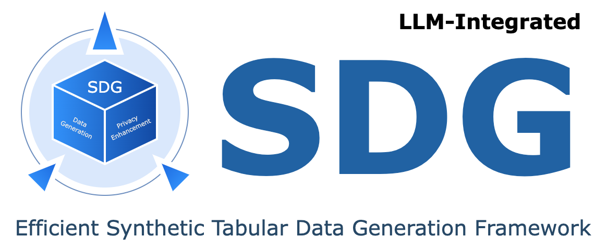

<div align="center">
  
</div>
<div align="center">
<p align="center">

<p align="center">
<a href="https://github.com/hitsz-ids/synthetic-data-generator/actions"></a>
<a href='https://synthetic-data-generator.readthedocs.io/en/latest/?badge=latest'></a>
<a href="https://results.pre-commit.ci/latest/github/hitsz-ids/synthetic-data-generator/main"></a>
<a href="https://github.com/hitsz-ids/synthetic-data-generator/blob/main/LICENSE"></a>
<a href="https://github.com/hitsz-ids/synthetic-data-generator/releases/"></a>
<a href="https://github.com/hitsz-ids/synthetic-data-generator/releases/"></a>
<a href="https://github.com/hitsz-ids/synthetic-data-generator"></a>
<a href="https://github.com/hitsz-ids/synthetic-data-generator"></a>
<a href="https://github.com/hitsz-ids/synthetic-data-generator/contributors"></a>
<a href="https://join.slack.com/t/hitsz-ids/shared_invite/zt-2395mt6x2-dwf0j_423QkAgGvlNA5E1g"></a>
</p>

# 🚀 Synthetic Data Generator

<p style="font-size: small;">Switch Language:
    <a href="https://github.com/hitsz-ids/synthetic-data-generator/blob/main/README_ZH_CN.md" target="_blank">简体中文</a> &nbsp;| &nbsp;Latest  
    <a href="https://synthetic-data-generator.readthedocs.io/en/latest/" target="value">API Docs</a>&nbsp;| &nbsp; Join <a href="https://synthetic-data-generator.readthedocs.io/en/latest/" target="value">Wechat Group</a>
</p>

<p style="font-size: small;">
    View Colab Examples:
    <a href="https://colab.research.google.com/drive/1cMB336jN3kb-m_pr1aJjshnNep_6bhsf?usp=sharing" target="value">CTGAN</a>
    &nbsp;| &nbsp;
    <a href="https://colab.research.google.com/drive/1VFnP59q3eoVtMJ1PvcYjmuXtx9N8C7o0?usp=sharing" target="value"> LLM: Data Synthesis</a>
    &nbsp;| &nbsp;
    <a href="https://colab.research.google.com/drive/1_chuTVZECpj5fklj-RAp7ZVrew8weLW_?usp=sharing" target="value"> LLM: Off-table Feature Inference</a>
</p>

</p>
</div>

The Synthetic Data Generator (SDG) is a specialized framework designed to generate high-quality structured tabular data. It incorporates a wide range of single-table, multi-table data synthesis algorithms and LLM-based synthetic data generation models.

Synthetic data, generated by machines using real data, metadata, and algorithms, does not contain any sensitive information, yet it retains the essential characteristics of the original data. There is no direct correlation between synthetic data and real data, making it exempt from privacy regulations such as GDPR and ADPPA. This eliminates the risk of privacy breaches in practical applications.

High-quality synthetic data can be safely utilized across various domains including data sharing, model training and debugging, system development and testing, etc. Read [**latest API docs**](https://synthetic-data-generator.readthedocs.io/en/latest/) for more details!

## 🔧 Features

- Technological advancements
  - Supports a wide range of statistical data synthesis algorithms, LLM-based synthetic data generation model is also integrated;
  - Optimised for big data scenarios, effectively reducing memory consumption;
  - Continuously tracking the latest advances in academia and industry, and introducing support for excellent algorithms and models in a timely manner.
- Privacy enhancements
  - SDG supports differential privacy, anonymization and other methods to enhance the security of synthetic data.
- Easy to extend
  - Supports expansion of models, data processing, data connectors, etc. in the form of plug-in packages

### 🎉 LLM-integrated synthetic data generation

For a long time, LLM has been used to understand and generate various types of data. In fact, LLM also has certain capabilities in tabular data generation. Also, it has some abilities that cannot be achieved by traditional (based on GAN methods or statistical methods) .

Our `sdgx.models.LLM.single_table.gpt.SingleTableGPTModel` implements two new features:

#### Synthetic data generation without Data

No training data is required, synthetic data can be generated based on metadata data, view in our <a href="https://colab.research.google.com/drive/1VFnP59q3eoVtMJ1PvcYjmuXtx9N8C7o0?usp=sharing" target="value"> colab example</a>.


#### Off-Table feature inference

Infer new column data based on the existing data in the table and the knowledge mastered by LLM, view in our <a href="https://colab.research.google.com/drive/1_chuTVZECpj5fklj-RAp7ZVrew8weLW_?usp=sharing" target="value"> colab example</a>.


## 🔛 Quick Start

### Pre-build image

You can use pre-built images to quickly experience the latest features.

```bash
docker pull idsteam/sdgx:latest
```

### Install from PyPi

```bash
pip install sdgx
```

### Local Install (Recommended)

Use SDG by installing it through the source code.

```bash
git clone git@github.com:hitsz-ids/synthetic-data-generator.git
pip install .
# Or install from git
pip install git+https://github.com/hitsz-ids/synthetic-data-generator.git
```

### Quick Demo of Single Table Data Generation and Metric

#### Demo code

```python
from sdgx.data_connectors.csv_connector import CsvConnector
from sdgx.models.ml.single_table.ctgan import CTGANSynthesizerModel
from sdgx.synthesizer import Synthesizer
from sdgx.utils import download_demo_data

# This will download demo data to ./dataset
dataset_csv = download_demo_data()

# Create data connector for csv file
data_connector = CsvConnector(path=dataset_csv)

# Initialize synthesizer, use CTGAN model
synthesizer = Synthesizer(
    model=CTGANSynthesizerModel(epochs=1),  # For quick demo
    data_connector=data_connector,
)

# Fit the model
synthesizer.fit()

# Sample
sampled_data = synthesizer.sample(1000)
print(sampled_data)
```

#### Comparison

Real data are as follows：

```python
>>> data_connector.read()
       age         workclass  fnlwgt  education  ...  capitalloss hoursperweek native-country  class
0        2         State-gov   77516  Bachelors  ...            0            2  United-States  <=50K
1        3  Self-emp-not-inc   83311  Bachelors  ...            0            0  United-States  <=50K
2        2           Private  215646    HS-grad  ...            0            2  United-States  <=50K
3        3           Private  234721       11th  ...            0            2  United-States  <=50K
4        1           Private  338409  Bachelors  ...            0            2           Cuba  <=50K
...    ...               ...     ...        ...  ...          ...          ...            ...    ...
48837    2           Private  215419  Bachelors  ...            0            2  United-States  <=50K
48838    4               NaN  321403    HS-grad  ...            0            2  United-States  <=50K
48839    2           Private  374983  Bachelors  ...            0            3  United-States  <=50K
48840    2           Private   83891  Bachelors  ...            0            2  United-States  <=50K
48841    1      Self-emp-inc  182148  Bachelors  ...            0            3  United-States   >50K

[48842 rows x 15 columns]

```

Synthetic data are as follows：

```python
>>> sampled_data
     age workclass  fnlwgt     education  ...  capitalloss hoursperweek native-country  class
0      1       NaN   28219  Some-college  ...            0            2    Puerto-Rico  <=50K
1      2   Private  250166       HS-grad  ...            0            2  United-States   >50K
2      2   Private   50304       HS-grad  ...            0            2  United-States  <=50K
3      4   Private   89318     Bachelors  ...            0            2    Puerto-Rico   >50K
4      1   Private  172149     Bachelors  ...            0            3  United-States  <=50K
..   ...       ...     ...           ...  ...          ...          ...            ...    ...
995    2       NaN  208938     Bachelors  ...            0            1  United-States  <=50K
996    2   Private  166416     Bachelors  ...            2            2  United-States  <=50K
997    2       NaN  336022       HS-grad  ...            0            1  United-States  <=50K
998    3   Private  198051       Masters  ...            0            2  United-States   >50K
999    1       NaN   41973       HS-grad  ...            0            2  United-States  <=50K

[1000 rows x 15 columns]
```

## 🤝 Join Community

The SDG project was initiated by **Institute of Data Security, Harbin Institute of Technology**. If you are interested in out project, welcome to join our community. We welcome organizations, teams, and individuals who share our commitment to data protection and security through open source:

- Read [CONTRIBUTING](./CONTRIBUTING.md) before draft a pull request.
- Submit an issue by viewing [View First Good Issue](https://github.com/hitsz-ids/synthetic-data-generator/issues/new) or submit a Pull Request.

## 👩‍🎓 Related Work

- CTGAN：[Modeling Tabular Data using Conditional GAN](https://proceedings.neurips.cc/paper/2019/hash/254ed7d2de3b23ab10936522dd547b78-Abstract.html)
- C3-TGAN: [C3-TGAN- Controllable Tabular Data Synthesis with Explicit Correlations and Property Constraints](https://www.researchgate.net/publication/374652636_C3-TGAN-_Controllable_Tabular_Data_Synthesis_with_Explicit_Correlations_and_Property_Constraints)
- TVAE：[Modeling Tabular Data using Conditional GAN](https://proceedings.neurips.cc/paper/2019/hash/254ed7d2de3b23ab10936522dd547b78-Abstract.html)
- table-GAN：[Data Synthesis based on Generative Adversarial Networks](https://arxiv.org/pdf/1806.03384.pdf)
- CTAB-GAN:[CTAB-GAN: Effective Table Data Synthesizing](https://proceedings.mlr.press/v157/zhao21a/zhao21a.pdf)
- OCT-GAN: [OCT-GAN: Neural ODE-based Conditional Tabular GANs](https://arxiv.org/pdf/2105.14969.pdf)

## 📄 License

The SDG open source project uses Apache-2.0 license, please refer to the [LICENSE](https://github.com/hitsz-ids/synthetic-data-generator/blob/main/LICENSE).
