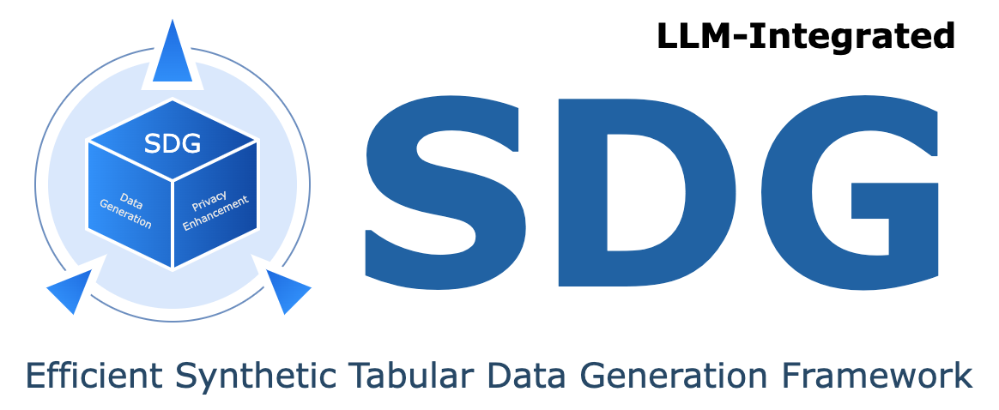

<div align="center">
  
</div>

<div align="center">
<p align="center">

<p align="center">
<a href="https://github.com/hitsz-ids/synthetic-data-generator/actions"></a>
<a href='https://synthetic-data-generator.readthedocs.io/en/latest/?badge=latest'></a>
<a href="https://results.pre-commit.ci/latest/github/hitsz-ids/synthetic-data-generator/main"></a>
<a href="https://github.com/hitsz-ids/synthetic-data-generator/blob/main/LICENSE"></a>
<a href="https://github.com/hitsz-ids/synthetic-data-generator/releases/"></a>
<a href="https://github.com/hitsz-ids/synthetic-data-generator/releases/"></a>
<a href="https://github.com/hitsz-ids/synthetic-data-generator"></a>
<a href="https://github.com/hitsz-ids/synthetic-data-generator"></a>
<a href="https://github.com/hitsz-ids/synthetic-data-generator/contributors"></a>
<a href="https://join.slack.com/t/hitsz-ids/shared_invite/zt-2395mt6x2-dwf0j_423QkAgGvlNA5E1g"></a>
</p>

# 🚀 合成数据生成器 -- 快速生成高质量合成数据！

<p style="font-size: small;">切换语言:
    <a href="https://github.com/hitsz-ids/synthetic-data-generator/blob/main/README.md" target="_blank">English</a>
  </p>

</p>
</div>


合成数据生成器（Synthetic Data Generator，SDG）是一个专注于快速生成高质量的结构化表格数据的数据组件。支持单表和多表数据合成算法，为了增强合成数据的安全性，SDG支持差分隐私和其他先进的方法。

合成数据（Synthetic Data）是由计算机使用真实数据、元数据和算法生成的合成数据不包含任何敏感信息，但它保留了原始数据的基本特性。合成数据和真实数据之间没有直接的关联，使其免于GDPR和ADPPA等隐私法规的约束，消除实际应用中的隐私泄露风险。

高质量的合成数据可以安全、多样化地在各种领域中使用，包括数据共享、模型训练和调试、系统开发和测试等应用。阅读 [最新API文档](https://synthetic-data-generator.readthedocs.io/en/latest/) 获取更多细节.


## 🔧  主要特性

- 高性能
  - 支持多种统计学数据合成算法，实现最高120倍性能提升，不需要GPU设备；
  - 为大数据场景优化，有效减少内存消耗；
  - 持续跟踪学术界和工业界的最新进展，及时引入支持优秀算法和模型。
  - 为深度学习模型提供torch等框架的分布式训练支持
- 隐私增强
  - 提供中文敏感数据自动识别能力，包括姓名、身份证号、人名等17种常见敏感字段；
  - 支持差分隐私、匿名化等方法，加强合成数据安全性。
- 易扩展
  - 支持以插件包的形式拓展模型、数据处理、数据连接器等功能


## 🔛 快速开始

### 预构建镜像

您可以使用预构建的镜像来快速体验最新功能。

```bash
docker pull idsteam/sdgx:latest
```

### 从本地安装（目前推荐）

目前本项目的代码更新速度快，我们推荐您通过源码进行安装的方式使用SDG。

```bash
git clone git@github.com:hitsz-ids/synthetic-data-generator.git
pip install .
# 或者直接从git安装
pip install git+https://github.com/hitsz-ids/synthetic-data-generator.git
```

### 从Pypi安装

```bash
pip install sdgx
```

### 单表数据快速合成示例

#### 演示代码

```python
from sdgx.data_connectors.csv_connector import CsvConnector
from sdgx.models.ml.single_table.ctgan import CTGANSynthesizerModel
from sdgx.synthesizer import Synthesizer
from sdgx.utils import download_demo_data

# This will download demo data to ./dataset
dataset_csv = download_demo_data()

# Create data connector for csv file
data_connector = CsvConnector(path=dataset_csv)

# Initialize synthesizer, use CTGAN model
synthesizer = Synthesizer(
    model=CTGANSynthesizerModel(epochs=1),  # For quick demo
    data_connector=data_connector,
)

# Fit the model
synthesizer.fit()

# Sample
sampled_data = synthesizer.sample(1000)
print(sampled_data)
```

#### 对比

真实数据：

```python
>>> data_connector.read()
       age         workclass  fnlwgt  education  ...  capitalloss hoursperweek native-country  class
0        2         State-gov   77516  Bachelors  ...            0            2  United-States  <=50K
1        3  Self-emp-not-inc   83311  Bachelors  ...            0            0  United-States  <=50K
2        2           Private  215646    HS-grad  ...            0            2  United-States  <=50K
3        3           Private  234721       11th  ...            0            2  United-States  <=50K
4        1           Private  338409  Bachelors  ...            0            2           Cuba  <=50K
...    ...               ...     ...        ...  ...          ...          ...            ...    ...
48837    2           Private  215419  Bachelors  ...            0            2  United-States  <=50K
48838    4               NaN  321403    HS-grad  ...            0            2  United-States  <=50K
48839    2           Private  374983  Bachelors  ...            0            3  United-States  <=50K
48840    2           Private   83891  Bachelors  ...            0            2  United-States  <=50K
48841    1      Self-emp-inc  182148  Bachelors  ...            0            3  United-States   >50K

[48842 rows x 15 columns]

```

仿真数据：

```python
>>> sampled_data
     age workclass  fnlwgt     education  ...  capitalloss hoursperweek native-country  class
0      1       NaN   28219  Some-college  ...            0            2    Puerto-Rico  <=50K
1      2   Private  250166       HS-grad  ...            0            2  United-States   >50K
2      2   Private   50304       HS-grad  ...            0            2  United-States  <=50K
3      4   Private   89318     Bachelors  ...            0            2    Puerto-Rico   >50K
4      1   Private  172149     Bachelors  ...            0            3  United-States  <=50K
..   ...       ...     ...           ...  ...          ...          ...            ...    ...
995    2       NaN  208938     Bachelors  ...            0            1  United-States  <=50K
996    2   Private  166416     Bachelors  ...            2            2  United-States  <=50K
997    2       NaN  336022       HS-grad  ...            0            1  United-States  <=50K
998    3   Private  198051       Masters  ...            0            2  United-States   >50K
999    1       NaN   41973       HS-grad  ...            0            2  United-States  <=50K

[1000 rows x 15 columns]
```

## 🤝  如何贡献

SDG开源项目由**哈尔滨工业大学（深圳）数据安全研究院**发起，若您对SDG项目感兴趣并愿意一起完善它，欢迎加入我们的开源社区：

- 非常欢迎你的加入！[提一个 Issue](https://github.com/hitsz-ids/synthetic-data-generator/issues/new) 或者提交一个 Pull Request。
- 开发环境配置请参考[开发者文档](./CONTRIBUTING.md)

## 👩‍🎓 相关工作

### 论文

- CTGAN：[Modeling Tabular Data using Conditional GAN](https://proceedings.neurips.cc/paper/2019/hash/254ed7d2de3b23ab10936522dd547b78-Abstract.html)
- TVAE：[Modeling Tabular Data using Conditional GAN](https://proceedings.neurips.cc/paper/2019/hash/254ed7d2de3b23ab10936522dd547b78-Abstract.html)
- table-GAN：[Data Synthesis based on Generative Adversarial Networks](https://arxiv.org/pdf/1806.03384.pdf)
- CTAB-GAN:[CTAB-GAN: Effective Table Data Synthesizing](https://proceedings.mlr.press/v157/zhao21a/zhao21a.pdf)
- OCT-GAN: [OCT-GAN: Neural ODE-based Conditional Tabular GANs](https://arxiv.org/pdf/2105.14969.pdf)

### 数据集

- [Adult数据集](http://archive.ics.uci.edu/ml/datasets/adult)
- [Satellite数据集](http://archive.ics.uci.edu/dataset/146/statlog+landsat+satellite)
- [Rossmann数据集](https://www.kaggle.com/competitions/rossmann-store-sales/data)
- [Telstra数据集](https://www.kaggle.com/competitions/telstra-recruiting-network/data)

## 📄 许可证

SDG开源项目使用 Apache-2.0 license，有关协议请参考[LICENSE](https://github.com/hitsz-ids/synthetic-data-generator/blob/main/LICENSE)。
