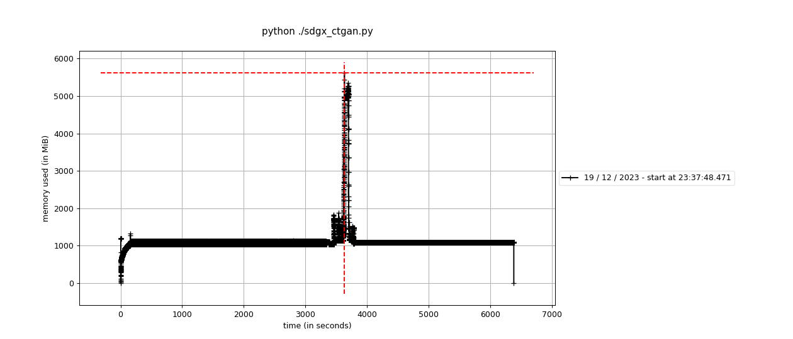
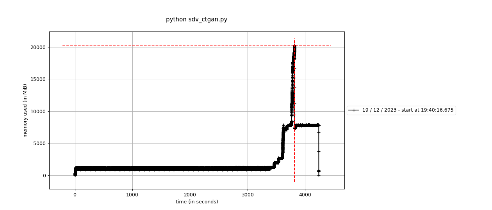

# WIP

Please help us to improve our benchmark: https://github.com/hitsz-ids/synthetic-data-generator/issues/82

## Benchmarks

Benchmarks aim to measure the performance of the library.

- Performance: Processing time, Training time of model, Simpling rate...
- Memory Consumption
- Others, like cache hit rate...

Now we provide a simple benchmark for our CTGAN implementation against the original one. Fit them with a big ramdom dataset, and compare their memory consumptions.

### Setup

```bash
# Clone and install latest version
# You can also use our latest image: docker pull idsteam/sdgx:latest
git clone https://github.com/hitsz-ids/synthetic-data-generator.git
cd synthetic-data-generator && pip install -e ./
# Setup benchmark
cd benchmarks
pip install -r requirements.txt
```

Generate a dataset with `python generate_dataset.py`, you can use `python generate_dataset.py --help` to see the usage.

### Benchmark our implementation

We use [memory_profiler](https://github.com/pythonprofilers/memory_profiler) to benchmark our implementation.

```bash
mprof run python ./sdgx_ctgan.py
```

Plot the results with `mprof plot` or `mprof plot --output=sdgx_ctgan.png` to save the plot.

### Benchmark original implementation

```bash
pip install ctgan
mprof run python ./sdv_ctgan.py
```

Plot the results with `mprof plot` or `mprof plot --output=sdv_ctgan.png` to save the plot.

## Results

In default settings, our implementation can fit 1,000,000 x 50 size dataset in 32GB(usable nearly 20GB) memory mechine. And the original implementation need more than 20GB memory and crashed during training.




